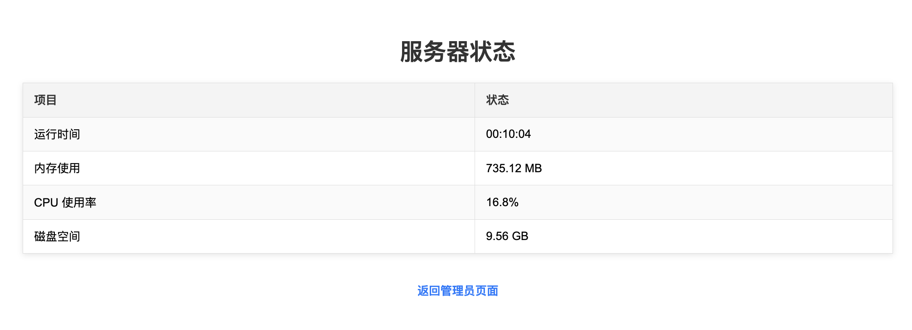
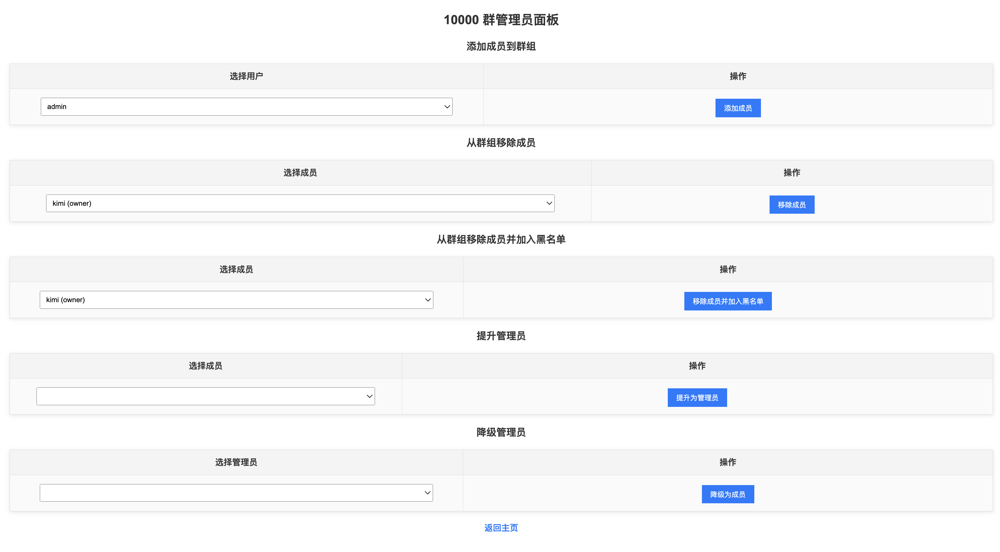
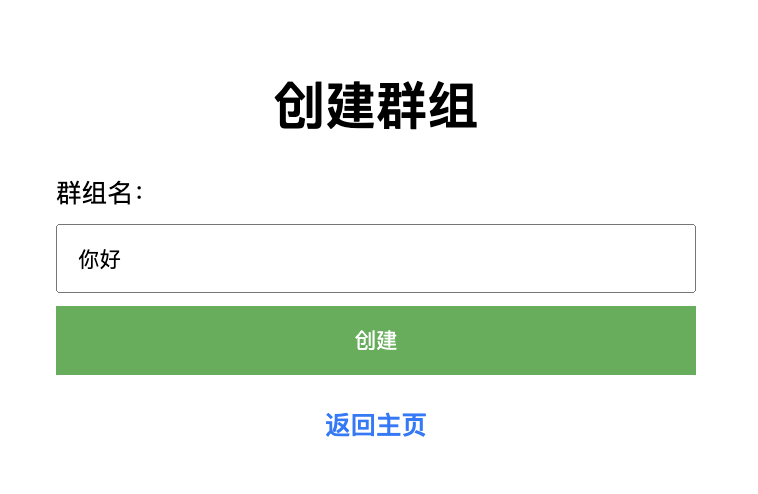
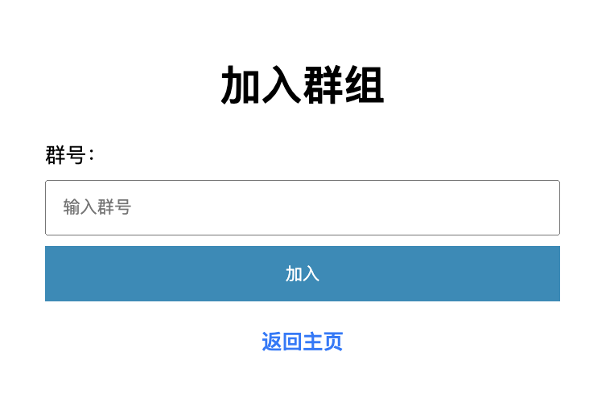

[](https://github.com/zjx-kimi/Chat/actions/workflows/deploy.yml)

# 项目介绍

本项目是一个基于 Python 构建的即时聊天应用，用户可以通过创建、加入群组进行实时聊天，同时管理员拥有管理用户和群组的功能。下文展示了项目部分功能的截图与简要说明。

## 功能展示

### 1. 服务器状态监控
该功能页面显示了服务器的运行时长、内存使用情况、CPU 使用率以及磁盘空间使用情况。


### 2. 群聊界面
这是群聊的主界面，用户可以在此实时看到群聊消息并参与聊天。


### 3. 群组管理面板
管理员可以通过该界面对群组成员进行管理，添加或移除群成员，以及提升或降级成员为管理员。


### 4. 用户管理面板
管理员可在此面板中管理所有注册用户，并对违规用户进行封禁操作。


### 5. 创建群组
用户可以通过该界面创建新的群组，输入群组名称后点击创建即可。


### 6. 加入群组
用户可以通过输入群组编号加入已创建的群组，与其他成员进行聊天互动。


## 使用方法
```bash
git clone https://github.com/zjx-kimi/Chat.git
cd Chat
python3 -m venv venv           
cd venv               
source bin/activate
cd ..    
pip install -r requirements.txt
python app.py
```
## Dome
Application is live at: https://94e34c7.r19.cpolar.top
